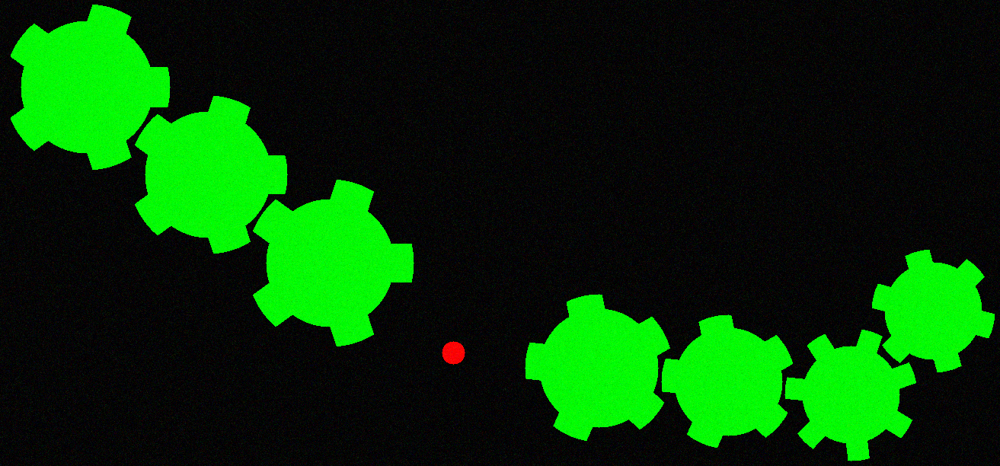
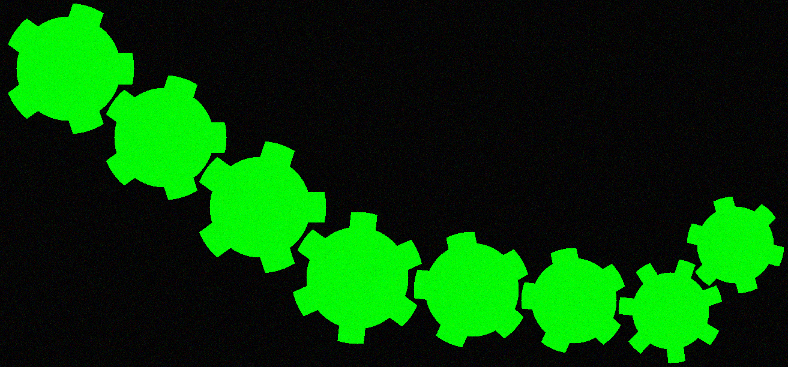
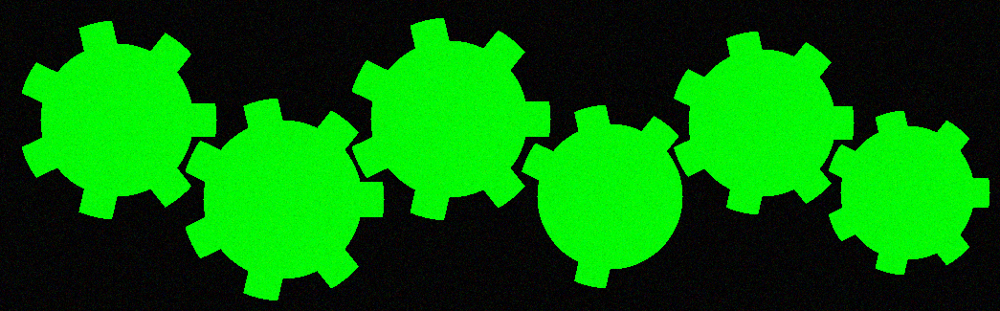
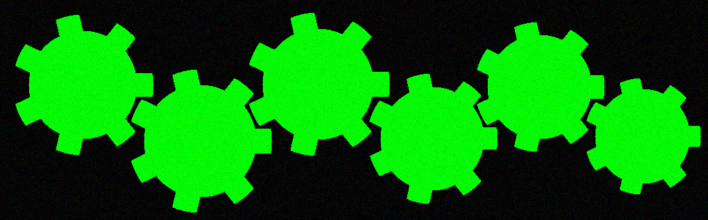

# gear_project

# Формулировка задачи

##### На картинке отображены шестеренки. На некоторых местах шестеренки могут отсутствовать или быть сломанными. 
##### Нужно найти координаты сломанной или отсутствующей шестеренки и заменить на подходящий вариант(всего вариантов 3).
---
####  Для сборки и компиляции достаточно набрать команду в папке build

cmake ..

cmake --build .

#### После сборки и компиляции должна появиться рабочая программа main, ее нужно найти и перетащить в корневую директорию.
#### Скорее всего она будет располагаться в build/src/
----
#### Пример запуска 
./main data/pic/0001.bmp  0001.bmp 1 

##### Где data/pic/0001.bmp путь к исходной картинке

#### Где 0001.bmp путь и название к исправленной картинке

#### Где 1 - это текстовый файл, который хранит геометрические характеристики объектов. 
#### Если объект - это ось, то там будут записаны координаты. Если объект - это шестеренка, то помимо координат,будут указаны минимальный радиус окружности, которая покрывает шестеренку,максимальный радуис окружности, которую шестеренка может покрыть, а также количество зубчиков и булевое значение, отвечающий на вопрос, является ли шестеренка сломанной.
---
#### Второй пример запуска 

./main data/pic/0006.bmp  0006.bmp 6 

#### Где data/pic/0006.bmp путь к исходной картинке, где присутствует сломанная шестеренка

#### Где 0006.bmp путь и название к исправленной картинке

